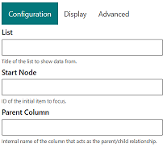

# Business Governance

Repository for creating a hierarchical representation of entities, e.g. legal entities, meeting forums, projects, or similar.

## Installation

1. Download the latest package `Vestas.BusinessGovernance.Core.sppkg` from [releases](https://github.com/vestas-digital-employee-tools/business-governance/releases).

2. Add `Vestas.BusinessGovernance.Core.sppkg` to the global tenant app catalog or a site collection app catalog. If you don't have an app catalog, follow this [procedure](https://docs.microsoft.com/en-us/sharepoint/use-app-catalog) to create one.

3. Add the Web Part to a page.

## Upgrading

The project uses [Semantic Versioning](https://semver.org/) to version the releases, to upgrade to the next compatible version, follow the steps:

1. Download the latest package `Vestas.BusinessGovernance.Core.sppkg` from [releases](https://github.com/vestas-digital-employee-tools/business-governance/releases).

2. Overwrite the existing file in your app catalog.

## Getting Started

### Empty Site

When the Web Part is inserted into a page, it will try to make qualified guesses about what data to show. If the
site is empty, it will not be able to make a guess, instead it will show:

Clicking the button will setup the initial lists and data structure to the the solution running:

### Existing Site

When inserting the Web Part into an existing site with data, the Web Part will show data from an arbitrary list. To
configure what data to show, edit the page and update the properties in the Web Part:

(The Bootstrap-functionality is also available from the Advanced tab)

## Development

-   Install [Node.js](https://nodejs.org/) `v18`
-   Fork & clone the repository
-   `npm install`
-   `npm run dev`
-   Make changes

Guidelines:

-   Use [Tailwind](https://tailwindcss.com/) instead of Sass
-   Use React function components
